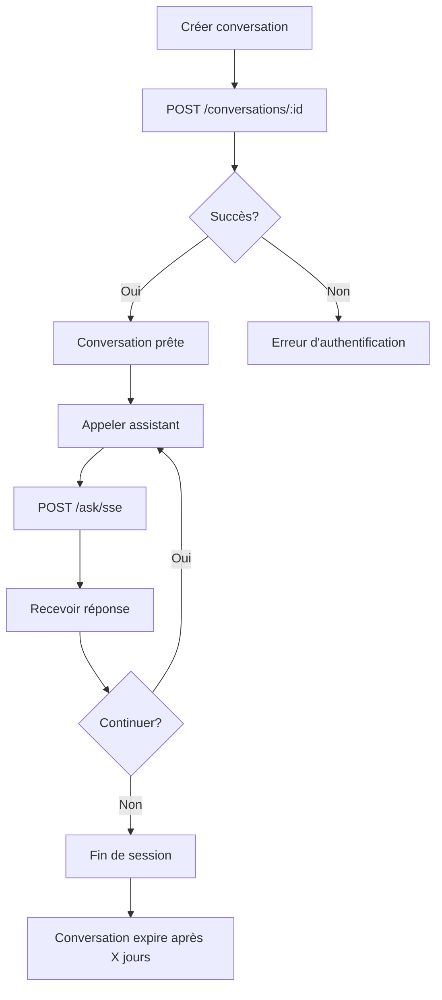

# Créer une Conversation

Avant d'appeler un assistant via `/ask/sse`, vous devez d'abord initialiser une conversation. Cet endpoint crée ou réinitialise une session de conversation.

## Endpoint

```http
POST /conversations/{conversationId}
```

## Headers requis

| Header | Valeur | Description |
|--------|--------|-------------|
| `Authorization` | `Bearer YOUR_API_KEY` | Clé API de l'assistant |
| `Content-Type` | `application/json` | Format du payload |

## Paramètres d'URL

| Paramètre | Type | Requis | Description |
|-----------|------|--------|-------------|
| `conversationId` | string | ✅ | Identifiant unique de la conversation (UUID recommandé) |

## Corps de la requête

```json
{}
```

Le corps est un objet JSON vide. La configuration de la conversation est déterminée par la clé API utilisée.

## Réponse

### Succès (200 OK)

```json
{
  "conversationId": "conv-550e8400-e29b-41d4-a716-446655440000",
  "status": "created",
  "createdAt": "2025-01-12T10:30:00Z"
}
```

### Erreur (401 Unauthorized)

```json
{
  "status": 401,
  "error": "Unauthorized",
  "message": "Invalid or missing API key"
}
```

## Exemples

### Exemple 1: cURL

```bash
curl -X POST "https://api-dev-auria-jask-sw-01.azurewebsites.net/conversations/conv-12345" \
  -H "Authorization: Bearer jask_api_key_abc123" \
  -H "Content-Type: application/json" \
  -d '{}'
```

### Exemple 2: Python avec httpx

```python
import httpx
from uuid import uuid4

async def create_conversation(api_key: str, conversation_id: str = None) -> str:
    """
    Crée une nouvelle conversation
    
    Args:
        api_key: Clé API de l'assistant
        conversation_id: ID de conversation (généré si non fourni)
    
    Returns:
        str: L'ID de la conversation créée
    """
    if conversation_id is None:
        conversation_id = str(uuid4())
    
    async with httpx.AsyncClient() as client:
        response = await client.post(
            f"https://api-dev-auria-jask-sw-01.azurewebsites.net/conversations/{conversation_id}",
            headers={
                "Authorization": f"Bearer {api_key}",
                "Content-Type": "application/json"
            },
            json={}
        )
        response.raise_for_status()
    
    print(f"Conversation créée: {conversation_id}")
    return conversation_id

# Utilisation
conversation_id = await create_conversation("jask_api_key_abc123")
```

### Exemple 3: JavaScript avec fetch

```javascript
async function createConversation(apiKey, conversationId = null) {
  if (!conversationId) {
    conversationId = crypto.randomUUID();
  }

  const response = await fetch(
    `https://api-dev-auria-jask-sw-01.azurewebsites.net/conversations/${conversationId}`,
    {
      method: 'POST',
      headers: {
        'Authorization': `Bearer ${apiKey}`,
        'Content-Type': 'application/json'
      },
      body: JSON.stringify({})
    }
  );

  if (!response.ok) {
    throw new Error(`HTTP error! status: ${response.status}`);
  }

  console.log(`Conversation créée: ${conversationId}`);
  return conversationId;
}

// Utilisation
const conversationId = await createConversation('jask_api_key_abc123');
```

## Cycle de vie d'une conversation



## Gestion des erreurs

### Erreur d'authentification

```python
try:
    conversation_id = await create_conversation("invalid_key")
except httpx.HTTPStatusError as e:
    if e.response.status_code == 401:
        print("Clé API invalide ou expirée")
    elif e.response.status_code == 403:
        print("Accès non autorisé à cet assistant")
```

### ID de conversation invalide

```python
# ❌ Mauvais format
invalid_id = "my conversation"  # Espaces non autorisés

# ✅ Bon format
valid_id = str(uuid4())  # UUID v4
# ou
valid_id = "conv-user-123-session-456"  # Slug valide
```


## Voir aussi

- [Call Assistant](/api/routes/assistants/call) - Utiliser la conversation
- [Conversation](/api/objets/conversation) - Structure de données
- [Response Formats](/api/objets/response) - Formats de réponse