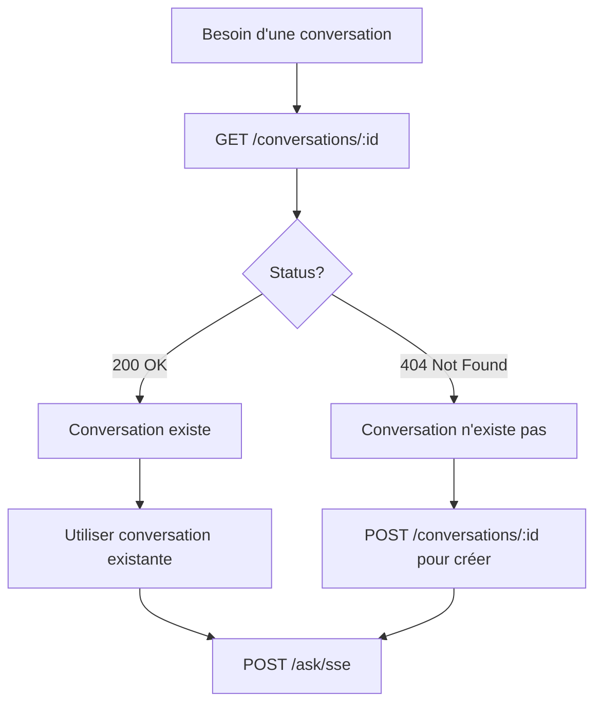

import { Tabs } from "nextra/components";

# Récupérer une Conversation

Cet endpoint permet de vérifier si une conversation existe et de récupérer ses informations. C'est utile pour éviter de réinitialiser accidentellement une conversation existante.

## Endpoint

```http
GET /conversations/{conversationId}
```

## Headers requis

| Header | Valeur | Description |
|--------|--------|-------------|
| `Authorization` | `Bearer YOUR_API_KEY` | Clé API de l'agent |

## Paramètres d'URL

| Paramètre | Type | Requis | Description |
|-----------|------|--------|-------------|
| `conversationId` | string | ✅ | Identifiant de la conversation à récupérer |

## Réponse

<Tabs items={['200 OK', '404 Not Found', '401 Unauthorized']} defaultIndex="0">
  <Tabs.Tab value="200 OK">
    ```json filename="200"
    {
      "conversationId": "conv-550e8400-e29b-41d4-a716-446655440000",
      "status": "active",
      "createdAt": "2025-01-12T10:30:00Z",
      "lastActivityAt": "2025-01-12T14:45:23Z"
    }
    ```
  </Tabs.Tab>
  <Tabs.Tab value="404 Not Found">
    ```json filename="404"
    {
      "status": 404,
      "error": "Not Found",
      "message": "Conversation not found or expired"
    }
    ```
  </Tabs.Tab>
  <Tabs.Tab value="401 Unauthorized">
    ```json filename="401"
    {
      "status": 401,
      "error": "Unauthorized",
      "message": "Invalid or missing API key"
    }
    ```
  </Tabs.Tab>
</Tabs>


## Cas d'usage

### 1. Vérifier l'existence avant création

Utilisez cet endpoint pour vérifier si une conversation existe avant de la créer, évitant ainsi de perdre le contexte existant.



### 2. Vérifier avant d'appeler un agent

Assurez-vous qu'une conversation est toujours valide avant de l'utiliser.

## Exemples

<Tabs items={['Python']} defaultIndex="0">
  <Tabs.Tab value="Python">
```python filename="conversation_exists.py"
import httpx

async def conversation_exists(conversation_id: str, api_key: str) -> bool:
    """
    Vérifie si une conversation existe
    
    Args:
        conversation_id: ID de la conversation à vérifier
        api_key: Clé API de l'agent
    
    Returns:
        bool: True si la conversation existe, False sinon
    """
    async with httpx.AsyncClient() as client:
        try:
            response = await client.get(
                f"https://{organization_jask_backend_name}.azurewebsites.net/conversations/{conversation_id}",
                headers={"Authorization": f"Bearer {api_key}"}
            )
            
            if response.status_code == 200:
                print(f"✓ Conversation {conversation_id} existe")
                return True
            elif response.status_code == 404:
                print(f"✗ Conversation {conversation_id} n'existe pas")
                return False
            else:
                print(f"⚠ Statut inattendu: {response.status_code}")
                return False
                
        except httpx.RequestError as e:
            print(f"Erreur réseau: {e}")
            return False

# Utilisation
exists = await conversation_exists("conv-12345", "jask_api_key_abc123")

if exists:
    print("Utiliser la conversation existante")
else:
    print("Créer une nouvelle conversation")
```

</Tabs.Tab>
</Tabs>


## Voir aussi

- [Create a conversation](/api/conversations/post) - Créer une nouvelle conversation
- [Ask an agent](/api/agents/post) - Appeler un agent