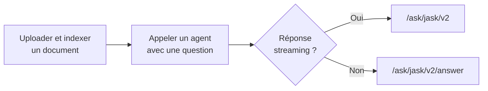

# Introduction à l'API Jask

Bienvenue dans la documentation de l'API Jask. Cette API permet d'intégrer des agents IA conversationnels, d'indexer des documents et d'exécuter des workflows d'automatisation dans vos applications.

## Base URL

La base URL varie selon l'organisation. Retrouvez-la sur le portail Azure (ressource API Jask) ou dans l'inspecteur réseau de la plateforme Jask.

```
https://{organization_jask_backend_name}/api/v1
```

Tous les endpoints documentés ci-dessous sont relatifs à cette base.

## Authentification

Chaque requête nécessite une clé API dans le header `Authorization` :

```http
Authorization: Bearer YOUR_API_KEY
```

La clé API est associée à un agent ou une application. Elle détermine les permissions et le comportement de l'endpoint appelé. Suivez la documentation [Clés API](/docs/deployment/teams#api-key-pour-les-applications-externes) pour en savoir plus sur la gestion des clés API.

## Types de réponses

| Type          | Format                | Usage                                                 |
| ------------- | --------------------- | ----------------------------------------------------- |
| **JSON**      | `application/json`    | Réponse agent sans streaming, upload/index, workflows |
| **SSE**       | `text/event-stream`   | Réponse agent en streaming token par token            |
| **Multipart** | `multipart/form-data` | Upload de fichiers                                    |

### Streaming (SSE)

Les endpoints agent v2 diffusent des événements au format :

```
data: {"type": "streaming", "value": "texte..."}
data: {"type": "end", "value": {"status": true}}
```

Voir [Formats de Réponse](/api/formats) pour la liste complète des événements.

### JSON standard

Les endpoints non-streaming retournent un objet ou un tableau JSON en une seule réponse.

## Endpoints

### Agents

| Endpoint                                              | Méthode | Description                                 |
| ----------------------------------------------------- | ------- | ------------------------------------------- |
| [`/assistant/ask/jask/v2`](/api/agents/post)          | POST    | Interroger un agent en streaming (SSE)      |
| [`/assistant/ask/jask/v2/answer`](/api/agents/answer) | POST    | Interroger un agent — réponse JSON complète |

Payload commun : `conversationId` + `query`. Aucune initialisation préalable de conversation n'est requise — un UUID génère automatiquement une nouvelle conversation.

### Documents

| Endpoint                                                          | Méthode | Description                                   |
| ----------------------------------------------------------------- | ------- | --------------------------------------------- |
| [`/documents/task/upload-and-index`](/api/documents/upload_index) | POST    | Uploader et indexer un fichier en une requête |

Les fichiers indexés sont utilisables en recherche (RAG) par les agents.

### Conversations

| Endpoint                                                   | Méthode | Description                           |
| ---------------------------------------------------------- | ------- | ------------------------------------- |
| [`/assistant/conversations/{id}`](/api/conversations/post) | POST    | Créer ou initialiser une conversation |
| [`/assistant/conversations/{id}`](/api/conversations/get)  | GET     | Récupérer une conversation existante  |

Optionnel pour les agents v2 (création automatique), utile pour gérer l'historique ou vérifier l'existence d'une session.

### Applications

| Endpoint                                 | Méthode | Description               |
| ---------------------------------------- | ------- | ------------------------- |
| [`/studio/apps/run`](/api/workflows/run) | POST    | Exécuter un workflow Jask |

## Parcours d'intégration type



1. **Indexer des documents** — `POST /documents/task/upload-and-index`
2. **Poser une question** — `POST /assistant/ask/jask/v2/answer` (simple) ou `/assistant/ask/jask/v2` (streaming)
3. **Poursuivre l'échange** — réutiliser le `conversationId` retourné

## Gestion des erreurs

### Erreurs HTTP

```json
{
  "error": "Invalid request"
}
```

| Code HTTP | Description                   |
| --------- | ----------------------------- |
| 400       | Requête invalide              |
| 401       | Clé API manquante ou invalide |
| 403       | Permissions insuffisantes     |
| 404       | Ressource non trouvée         |
| 422       | Corps de requête invalide     |
| 500       | Erreur serveur interne        |

### Erreurs SSE

En mode streaming, les erreurs arrivent dans le flux sous forme d'événement :

```json
data: {"type": "error", "value": "Description de l'erreur"}
```

## Prochaines étapes

- [Formats de Réponse](/api/formats) — structures de données et événements SSE
- [Agents](/api/agents/answer) — interagir avec un agent IA
- [Documents](/api/documents/upload_index) — uploader et indexer des fichiers
- [Conversations](/api/conversations/post) — gérer les sessions
- [Applications](/api/workflows/run) — exécuter des workflows
